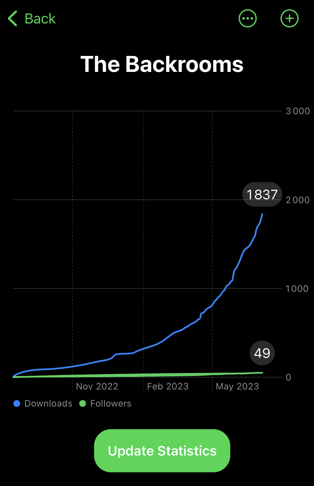
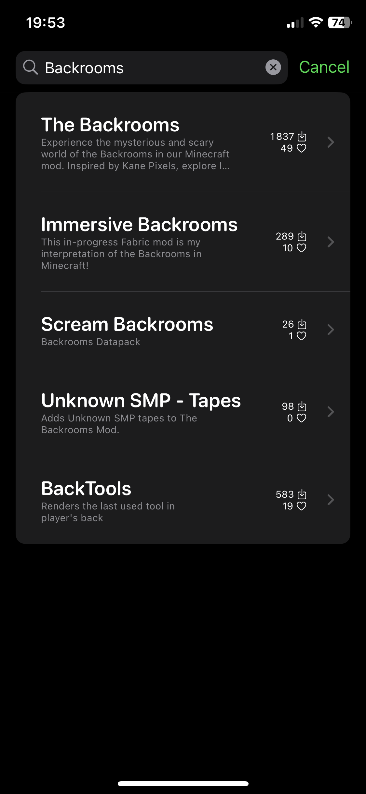

# Modrinth App
This is a very quick unofficial Modrinth app made in SwiftUI, and it uses `UserDefaults` to save "records" which are graphs of downloads and followers as shown [here](#graphics), using [Swift Charts](https://developer.apple.com/documentation/charts), the official chart API made for SwiftUI by Apple mainly updated each year.

There is also the ["Mods"](#mods) page as well as the ["Search mods"](#search). When you click on a mod it displays [this very lazy view](#mod).

There are also more hidden features or features that are not written here.

* * *

**This app is not affiliated with Modrinth in any way.**

# Showcase images
All the screenshots were taken at [this specific commit](https://github.com/lumaa-dev/ModrinthApp/tree/f83b5a5ec569cf6b78a17fb12b3f42b44bf5cdbe). Images might not me accurate.

## Graphics
Mod displayed: [The Backrooms Mod](https://modrinth.com/mod/backrooms)

## Mods

## Search

## Mod
Mod displayed: [SkinShuffle](https://modrinth.com/mod/skinshuffle)

